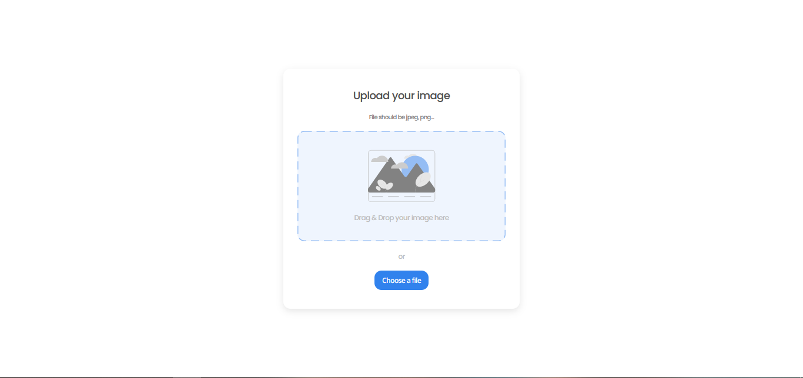

<!-- Please update value in the {}  -->

# Image Uploader

Solution for a challenge from  <a href="http://devchallenges.io" target="_blank">Devchallenges.io</a>.
This is a solution to the [Image Uploader Challenge](https://devchallenges.io/challenges/O2iGT9yBd6xZBrOcVirx). 

<!-- TABLE OF CONTENTS -->

## Table of Contents

- [Overview](#overview)
  - [The challenge](#the-challenge)
  - [Screenshot](#screenshot)
  - [Links](#links)
- [My process](#my-process)
  - [Built with](#built-with)
  - [What I learned](#what-i-learned)
  - [How to use](#how-to-use)
  - [Continued development](#continued-development)
  - [Useful resources](#useful-resources)
- [Author](#author)

<!-- OVERVIEW -->

## Overview

### The challenge

Create an Image Uploader application. Use any front-end libraries of your choice. Create your API. Don’t look at the existing solution. Fulfill user stories below:
- User story: I can drag and drop an image to upload it
- User story: I can choose to select an image from my folder
- User story: I can see a loader when uploading
- User story: When the image is uploaded, I can see the image and copy it
- User story: I can choose to copy to the clipboard

### Screenshot



### Features

- You can drag and drop image files on the dedicated area
- You can see a hover effect while doing so
- Only image files are allowed
- A loader shows up before showing the uploaded photo
- You copy the link of the photo

### What I learned
- I learnt how to create url for uploaded files using file objects. I also learnt about dragover, dragleave and drop events.

### Continued Development
- I would like to make the third page responsive like others but I haven't been able to do it yet. 
- I am thinking of using PostCSS to make the code compatible with all browsers.

## How To Use

<!-- Example: -->

To clone and run this application, you'll need [Git](https://git-scm.com) installed on your computer. From your command line:

```bash
# Clone this repository
$ git clone https://github.com/your-user-name/your-project-name

# Now just open the HTML file in browser or use a static server in VS Code
```
## Contact

- GitHub [@husnain214](https://{github.com/husnain214})
